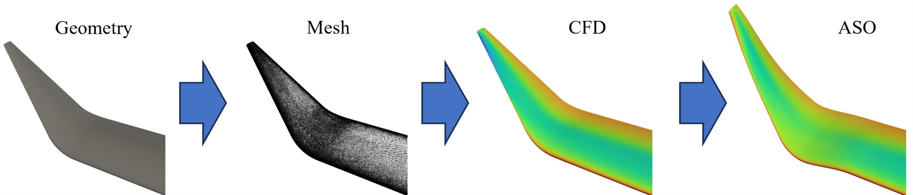

<p align="center">
  
</p>

# Automated Workflow for Geometry Generation, Mesh Generation, CFD Simulation, and ASO

**Author**: Jaime Galiana Herrera

**Final-Year Project** in fulfillment of MEng Aeronautics with Spacecraft Engineering

**To be run on Imperial HPC**


## Table of Contents
1. [Overview](#overview)
2. [Prerequisites](#prerequisites)
3. [Setting Up the Problem](#setting-up-the-problem)
   - [Updating Paths](#updating-paths)
   - [Compiling SU2 with AD Capabilities](#compiling-su2-with-ad-capabilities)
4. [Preparing the Environment](#step-1-preparing-the-environment)
5. [Running the Automation Script](#step-2-running-the-automation-script)
   - [Command-Line Arguments](#command-line-arguments)
   - [Example Command](#example-command)
6. [Understanding the Workflow](#step-3-understanding-the-workflow)
7. [Post-Processing](#post-processing)
   - [Extracting Coefficients](#extracting-coefficients)
8. [Usage Notes](#usage-notes)
9. [License](#license)

## Overview

This workflow automates the following steps:

1. **Geometry Generation**: Creating the geometry of the winglet.
2. **Mesh Generation**: Generating the computational mesh with or without a prism layer.
3. **CFD Simulation**: Running the Computational Fluid Dynamics (CFD) simulation to analyze the flow.
4. **ASO**: Running the Aerodynamic Shape Optimization based on CFD results.

<p align="center">
  
</p>

## Prerequisites

Ensure all required modules are installed and available in your environment. This includes tools like:
- [OpenMPI](https://www.open-mpi.org/)
- [STAR-CCM+](https://mdx.plm.automation.siemens.com/star-ccm-plus) (v16.04.012-R8)
- [Anaconda](https://www.anaconda.com/products/distribution)
- [SU2](https://su2code.github.io/) (v7.2.0 and v8.0.0)S
- [OpenVSP](http://openvsp.org/) (v3.37.0)


## Setting Up the Process

### Updating Paths

To set up this project, you need to update all the paths to the respective software and folders. This is done using the `update_paths.py` script. The script updates the paths in specific Python files within your project directory to point to the correct locations of your main folder, OpenVSP, SU2 source files, SU2 compiled binaries, and the output folder. It also replaces a placeholder key in `mesh_generation.py` if necessary.

#### How to Use the `update_paths.py` Script

1. **Save the Script**: Save the `update_paths.py` script in your project directory.
2. **Make the Script Executable**: If you're on a Unix-like system, make the script executable by running:
    ```sh
    chmod +x update_paths.py
    ```
3. **Run the Script**: Use the command line to run the script and provide the necessary arguments. Here’s an example:
    ```sh
    python3 update_paths.py /path/to/your/project --main /new/path/to/main --openvsp /new/path/to/OpenVSP_v3.37.0_Compiled --su2_v72_src /new/path/to/SU2_v7.2.0_Source --su2_v72_bin /new/path/to/SU2_v7.2.0_Binaries --su2_v80_src /new/path/to/SU2_v8.0.0_Source --su2_v80_bin /new/path/to/SU2_v8.0.0_Binaries --output /new/path/to/main/output --key your_actual_key
    ```

### Compiling SU2 with AD Capabilities

To leverage the AD capabilities in SU2 for shape optimization, it is necessary to compile SU2 with these features enabled. Unfortunately, the process of compiling SU2 on an HPC system can be complex and lacks comprehensive documentation. The following script provides a way to compile the source code on the Imperial HPC system with these features enabled.

#### Script to Compile SU2 with AD

Save the following script and submit it to your HPC system:

```bash
#PBS -l walltime=8:00:00
#PBS -l select=1:ncpus=8:mem=200gb

module load tools/prod
module load Python/3.10.8-GCCcore-12.2.0
module load OpenMPI/4.1.4-GCC-12.2.0
module load CMake/3.24.3-GCCcore-12.2.0

# Environmental variables, not entirely sure if they are needed
export MPICC=$(which mpicc)
export MPICXX=$(which mpicxx)
export CC=mpicc
export CXX=mpicxx

# Path to folder where you want to place your source code
cd /rds/general/user/username/home/

# Clone last version of source code in the directory
git clone https://github.com/su2code/SU2.git

# Access the folder containing the source code
cd SU2

# --prefix= specify the path where you want the compiled code to be 
python3 ./meson.py build -Denable-autodiff=true -Denable-directdiff=true -Dwith-mpi=enabled --prefix=/path/to/install/directory

# j defines the number of cores to use (all available cores are used by default)
./ninja -j8 -C build install
```	

## Step 2: Preparing the Environment

Ensure you have all the necessary input files:
- `winggen.vspscript` for geometry generation.
- `macro_with_prism.java` and `macro_without_prism.java` for mesh generation.
- `Euler-cfd.py` and `RANS-cfd.py` for CFD simulation.
- `Euler-shapeOptimisation.py` and `RANS-shapeOptimisation.py` for ASO.

## Step 3: Running the Automation Script

Use the `main_runAutomation.py` script to set up and submit the job. This script takes various arguments to control which steps to run and their configurations.

### Command-Line Arguments:

| Argument       | Description                                 |
|----------------|---------------------------------------------|
| `-np`          | Number of parallel processes                |
| `-mem`         | Total memory of the process                 |
| `-time`        | Job time in hours                           |
| `-geo`         | Run geometry generation (0: No, 1: Yes)     |
| `-mesh`        | Run mesh generation (0: No, 1: Yes)         |
| `-prism-layer` | Include prism layer in mesh (0: No, 1: Yes) |
| `-cfd`         | Run CFD (0: No, 1: Yes)                     |
| `-cfd-solver`  | CFD Solver to use (`Euler` or `RANS`)       |
| `-aso`         | Run ASO (0: No, 1: Yes)                     |
| `-aso-solver`  | ASO Solver to use (`Euler` or `RANS`)       |

### Example Command:
```sh
python3 main_runAutomation.py -np 8 -mem 32 -time 8 -geo 1 -mesh 1 -prism-layer 0 -cfd 1 -cfd-solver euler -aso 1 -aso-solver euler
```

## Step 4: Understanding the Workflow

1. Setting Up Directories

- The `main_runAutomation.py` script creates directories for each winglet configuration and for each step (`GEOMETRY`, `MESH`, `CFD`, `ASO`).

2. Modifying the PBS Script

- The `main_runAutomation.py` script modifies the `submit_template.pbs` script to include the correct parameters and paths based on the user's input.

3. Submitting the Job

- The modified `submit_template.pbs` script is submitted to the job scheduler (qsub).

4. Running Geometry Generation

- If geometry generation is enabled (-geo 1), the winggen.vspscript file is used to generate the geometry.

5. Running Mesh Generation

- If mesh generation is enabled (-mesh 1), the mesh_generation.py script is invoked.
- The prism_layer argument determines whether the mesh includes a prism layer.
- For the RANS solver, the script iterates to adjust the prism layer based on y+ values.

6. Running CFD Simulation

- If CFD is enabled (`-cfd 1`), the run_CFD.py script runs the CFD simulation.
- For the RANS solver, the script checks y+ values and iterates mesh generation if necessary.

7. Running ASO

- If ASO is enabled (`-aso 1`), the `run_ASO.py` script runs the shape optimization based on CFD results.

## Post-Processing
# Extracting Coefficients

The software includes a script, extract_coefficients.py, which iterates through all winglet directories and extracts the CL and CD data. This script is crucial for analyzing the aerodynamic performance of the winglets.

The extract_coefficients.py script extracts the last Cl and Cd values from the simulation output files. It traverses the directories, collects the data, and saves the results to results.dat.


## Usage Notes

- Use the `main_runAutomation.py´ script to set up and submit the job.
- Ensure the correct directories and input files are in place.
- The `run_CFD.py` script includes an iterative process to adjust the mesh if the y+ values are too high, but this only applies to the RANS solver.
- Each script has specific roles and works together to complete the full workflow.

## License

This project is licensed under a Creative Commons Attribution-NonCommercial 4.0 International License. You are free to:
- **Share** — copy and redistribute the material in any medium or format
- **Adapt** — remix, transform, and build upon the material

The licensor cannot revoke these freedoms as long as you follow the license terms.

Under the following terms:
- **Attribution** — You must give appropriate credit, provide a link to the license, and indicate if changes were made. You may do so in any reasonable manner, but not in any way that suggests the licensor endorses you or your use.
- **NonCommercial** — You may not use the material for commercial purposes.

No additional restrictions — You may not apply legal terms or technological measures that legally restrict others from doing anything the license permits.

View the full license at: [http://creativecommons.org/licenses/by-nc/4.0/](http://creativecommons.org/licenses/by-nc/4.0/)