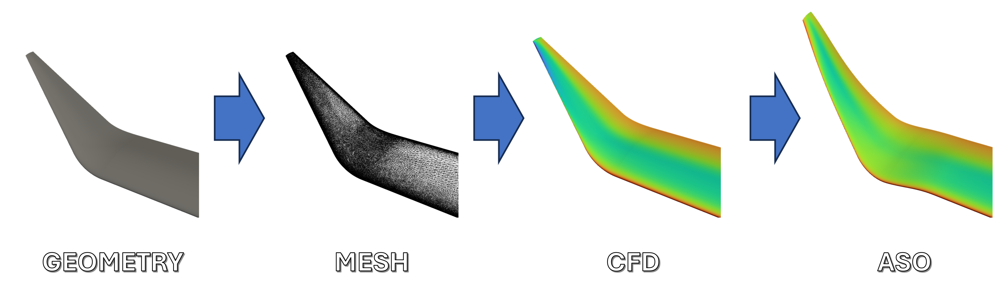

<p align="center">
  
</p>

# Automated Workflow for Geometry Generation, Mesh Generation, CFD Simulation, and ASO

**Author**: Jaime Galiana Herrera

**Final-Year Project** in fulfillment of MEng Aeronautics with Spacecraft Engineering

**To be run on Imperial HPC**


## Table of Contents
1. [Overview](#1-overview)
2. [Prerequisites](#2-prerequisites)
3. [Setting Up the Process](#3-setting-up-the-process)
   - [Set up Python Environment (Anaconda) on the HPC Cluster](#31-set-up-python-environment-anaconda-on-the-hpc-cluster)
   - [Compiling SU2 with AD Capabilities](#32-compiling-su2-with-ad-capabilities)
   - [Updating Paths](#33-updating-paths)
4. [Preparing the Environment](#4-preparing-the-environment)
5. [Running the Automation Script](#5-running-the-automation-script)
   - [Command-Line Arguments](#command-line-arguments)
   - [Example Command](#example-command)
6. [Understanding the Workflow](#6-understanding-the-workflow)
   - [Submitting the Automated Process](#submitting-the-automated-process)
   - [Setting Up Directories](#setting-up-directories)
   - [Modifying the PBS Script](#modifying-the-pbs-script)
   - [Submitting the Job](#submitting-the-job)
   - [Running Geometry Generation](#running-geometry-generation)
   - [Running Mesh Generation](#running-mesh-generation)
   - [Running CFD Simulation](#running-cfd-simulation)
   - [Running ASO](#running-aso)
7. [Post-Processing](#7-post-processing)
   - [Extracting Coefficients](#extracting-coefficients)
8. [Usage Notes](#8-usage-notes)
9. [License](#9-license)

## 1. Overview

This workflow automates the following steps:

1. **Geometry Generation**: Creating the geometry of the winglet.
2. **Mesh Generation**: Generating the computational mesh with or without a prism layer.
3. **CFD Simulation**: Running the Computational Fluid Dynamics (CFD) simulation to analyze the flow.
4. **ASO**: Running the Aerodynamic Shape Optimization based on CFD results.

<p align="center">
  
</p>

## 2. Prerequisites

Ensure all required modules are installed and available in your environment. This includes tools like:
- [OpenMPI](https://www.open-mpi.org/)
- [STAR-CCM+](https://mdx.plm.automation.siemens.com/star-ccm-plus) (v16.04.012-R8)
- [SU2](https://su2code.github.io/) (v7.2.0 and v8.0.0)
- [OpenVSP](http://openvsp.org/) (v3.37.0)
- [Anaconda](https://www.anaconda.com/products/distribution)

## 3. Setting Up the Process

### 3.1 Set up Python environment (Anaconda) on the HPC Cluster
To run this project on the HPC you need to set up a Python environment with the following libraries:
- numpy
- argparse
- scipy
- vtk

The project includes a script named `submit_setupPythonEnv.pbs` that automates the setup of the required Python environment.

#### Submit the PBS script to the HPC job scheduler to create the environment:

```bash
qsub submit_setupPythonEnv.pbs
```

### 3.2 Compiling SU2 with AD Capabilities

To leverage the AD capabilities in SU2 for shape optimization, it is necessary to compile SU2 with these features enabled. Unfortunately, the process of compiling SU2 on an HPC system can be complex and lacks comprehensive documentation. The following script provides a way to compile the source code on the Imperial HPC system with these features enabled.

#### 3.2.1. Modify the --prefix=/path/to/install/directory with the desired installation directory.

#### 3.2.2. Submit this scrtip to HPC system using the following command:

```bash
qsub submit_compileSU2.pbs
```	

#### 3.2.3. Grant execution permissions to the SU2 executables:

```bash
chmod +x SU2_CFD SU2_GEO SU2_DEF SU2_SOL SU2_CFD_AD SU2_DOT_AD
```

### 3.3 Updating Paths

To set up this project, you need to update all the paths to the respective software and main project folders. This is done using the `update_paths.py` script, which updates the paths in specific Python files within your project directory to point to the correct locations of your main folder, OpenVSP, SU2 source files, SU2 compiled binaries, and the output folder. It also replaces the Star-CCM+ license key in `mesh_generation.py` if necessary.

#### How to Use the `update_paths.py` Script

To run `update_paths.py`, the bash script `submit_updatePaths.pbs` is included in the main folder.

1. Modify the pbs Script:
Modify the following paths and Star+CCM+ key with you actual values.

| Argument                | Description                                     |
|-------------------------|-------------------------------------------------|
| `python3`               | Command to run the Python interpreter           |
| `./update_paths.py`     | Path to the script that updates the paths       |
| `/path/to/your/project` | Path to your project directory                  |
| `--main`                | Path to the main project folder                 |
| `--openvsp`             | Path to the compiled OpenVSP v3.37.0 directory  |
| `--su2_v72_src`         | Path to the SU2 v7.2.0 source directory         |
| `--su2_v72_bin`         | Path to the SU2 v7.2.0 binaries directory       |
| `--su2_v80_src`         | Path to the SU2 v8.0.0 source directory         |
| `--su2_v80_bin`         | Path to the SU2 v8.0.0 binaries directory       |
| `--output`              | Path to the output directory                    |
| `--key`                 | Your actual Star-CCM+ license key               |

2. Run the Script: Use the command line to run the script and provide the necessary arguments. 

```sh
qsub submit_updatePaths.pbs
```

## 4. Preparing the Environment

Ensure you have all the necessary template files:
- `winggen.vspscript` for geometry generation.
- `macro_with_prism.java` and `macro_without_prism.java` for mesh generation.
- `Euler-cfd.py` and `RANS-cfd.py` for CFD simulation.
- `Euler-shapeOptimisation.py` and `RANS-shapeOptimisation.py` for ASO.

One example is provided in the template directory for FLEXOP aricraft wing geometry. Modify as necessary for the desired wing geometry or flow conditions.

## 5. Running the Automation Script

Use the `main_runAutomation.py` script to set up and submit the job. This script takes various arguments to control which steps to run and their configurations.

### Command-Line Arguments:

| Argument       | Description                                 |
|----------------|---------------------------------------------|
| `-np`          | Number of parallel processes                |
| `-mem`         | Total memory of the process                 |
| `-time`        | Job time in hours                           |
| `-geo`         | Run geometry generation (0: No, 1: Yes)     |
| `-mesh`        | Run mesh generation (0: No, 1: Yes)         |
| `-prism-layer` | Include prism layer in mesh (0: No, 1: Yes) |
| `-cfd`         | Run CFD (0: No, 1: Yes)                     |
| `-cfd-solver`  | CFD Solver to use (`Euler` or `RANS`)       |
| `-aso`         | Run ASO (0: No, 1: Yes)                     |
| `-aso-solver`  | ASO Solver to use (`Euler` or `RANS`)       |

### Example Command:
```sh
python3 main_runAutomation.py -np 8 -mem 32 -time 8 -geo 1 -mesh 1 -prism-layer 0 -cfd 1 -cfd-solver euler -aso 1 -aso-solver euler
```

## 6. Understanding the Workflow

### 6.1. Submitting the Automated Process

The `submit_automated_process.pbs` script submits `main_runAutomation.py` with the desired list of input cant and sweep angles.

### 6.2. Setting Up Directories

The `main_runAutomation.py` script creates directories for each winglet configuration and subdirectories for each step (`GEOMETRY`, `MESH`, `CFD`, `ASO`).

### 6.3. Modifying the PBS Script

The `main_runAutomation.py` script modifies the `submit_template.pbs` script to include the correct parameters and paths based on the user's input.

### 6.4. Submitting the Job

The modified `submit_template.pbs` script is submitted to the job scheduler using `qsub`.

### 6.5. Running Geometry Generation

If geometry generation is enabled (`-geo 1`), the `winggen.vspscript` file is used to generate the geometry.

### 6.6. Running Mesh Generation

If mesh generation is enabled (`-mesh 1`):
- The `mesh_generation.py` script is invoked.
- The `-prism-layer` argument determines whether the mesh includes a prism layer.
- For the RANS solver, the script iterates to adjust the prism layer based on y+ values.

### 6.7. Running CFD Simulation

If CFD is enabled (`-cfd 1`):
- The `run_CFD.py` script runs the CFD simulation.
- For the RANS solver, the script checks y+ values and iterates mesh generation if necessary.

### 6.8. Running ASO

If ASO is enabled (`-aso 1`), the `run_ASO.py` script runs the shape optimization based on CFD results.

## 7. Post-Processing

### Extracting Coefficients

The software includes a script, `extract_coefficients.py`, which iterates through all winglet directories and extracts the CL and CD data. This is run using 

```sh
qsub submit_postProcessing.pbs
```


## 8. Usage Notes

- Use the `main_runAutomation.py` script to set up and submit the job.
- Ensure the correct directories and input files are in place.
- The `run_CFD.py` script includes an iterative process to adjust the mesh if the y+ values are too high, but this only applies to the RANS solver.
- Each script has specific roles and works together to complete the full workflow.

## 9. License

This project is licensed under a Creative Commons Attribution-NonCommercial 4.0 International License. You are free to:
- **Share** — copy and redistribute the material in any medium or format
- **Adapt** — remix, transform, and build upon the material

The licensor cannot revoke these freedoms as long as you follow the license terms.

Under the following terms:
- **Attribution** — You must give appropriate credit, provide a link to the license, and indicate if changes were made. You may do so in any reasonable manner, but not in any way that suggests the licensor endorses you or your use.
- **NonCommercial** — You may not use the material for commercial purposes.

No additional restrictions — You may not apply legal terms or technological measures that legally restrict others from doing anything the license permits.

View the full license at: [http://creativecommons.org/licenses/by-nc/4.0/](http://creativecommons.org/licenses/by-nc/4.0/)