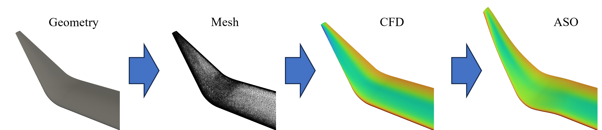

**Author**: Jaime Galiana Herrera

**Final-Year Project** in fulfillment of MEng Aeronautics with Spacecraft Engineering

**To be run on Imperial HPC**


## Overview

This workflow automates the following steps:

1. **Geometry Generation**: Creating the geometry of the winglet.
2. **Mesh Generation**: Generating the computational mesh with or without a prism layer.
3. **CFD Simulation**: Running the Computational Fluid Dynamics (CFD) simulation to analyze the flow.
4. **ASO**: Running the Aerodynamic Shape Optimization based on CFD results.



## Prerequisites

Ensure all required modules are installed and available in your environment. This includes tools like:
- `OpenMPI`
- `star-ccm+`
- `anaconda3`
- `SU2`

## Step 1: Preparing the Environment

Ensure you have all the necessary input files:
- `winggen.vspscript` for geometry generation.
- `macro_with_prism.java` and `macro_without_prism.java` for mesh generation.
- `Euler-cfd.py` and `RANS-cfd.py` for CFD simulation.
- `Euler-shapeOptimisation.py` and `RANS-shapeOptimisation.py` for ASO.

## Step 2: Running the Automation Script

Use the `main_runAutomation.py` script to set up and submit the job. This script takes various arguments to control which steps to run and their configurations.

### Command-Line Arguments:
- `-np`: Number of parallel processes.
- `-mem`: Total memory of the process.
- `-time`: Job time in hours.
- `-geo`: Run geometry generation (0: No, 1: Yes).
- `-mesh`: Run mesh generation (0: No, 1: Yes).
- `-prism-layer`: Include prism layer in mesh (0: No, 1: Yes).
- `-cfd`: Run CFD (0: No, 1: Yes).
- `-cfd-solver`: CFD Solver to use (`Euler` or `RANS`).
- `-aso`: Run ASO (0: No, 1: Yes).
- `-aso-solver`: ASO Solver to use (`Euler` or `RANS`).

### Example Command:
```sh
python main_runAutomation.py -np 8 -mem 32 -time 8 -geo 1 -mesh 1 -prism-layer 0 -cfd 1 -cfd-solver euler -aso 1 -aso-solver euler
```

## Step 3: Understanding the Workflow

1. Setting Up Directories

- The `main_runAutomation.py` script creates directories for each winglet configuration and for each step (`GEOMETRY`, `MESH`, `CFD`, `ASO`).

2. Modifying the PBS Script

- The `main_runAutomation.py` script modifies the submit_template.pbs script to include the correct parameters and paths based on the user's input.

3. Submitting the Job

- The modified `submit_template.pbs` script is submitted to the job scheduler (qsub).

4. Running Geometry Generation

- If geometry generation is enabled (-geo 1), the winggen.vspscript file is used to generate the geometry.

5. Running Mesh Generation

- If mesh generation is enabled (-mesh 1), the mesh_generation.py script is invoked.
- The prism_layer argument determines whether the mesh includes a prism layer.
- For the RANS solver, the script iterates to adjust the prism layer based on y+ values.

6. Running CFD Simulation

- If CFD is enabled (`-cfd 1`), the run_CFD.py script runs the CFD simulation.
- For the RANS solver, the script checks y+ values and iterates mesh generation if necessary.

7. Running ASO

- If ASO is enabled (`-aso 1`), the `run_ASO.py` script runs the shape optimization based on CFD results.

Summary of Changes in the Scripts

`main_runAutomation.py`

- Sets up the correct parameters and passes the new `PRISM_LAYER` argument.
- Ensures the correct solver and prism layer settings are used.
- Modifies the `submit_template.pbs` script dynamically.

`submit_template.pbs`

- Reads the `PRISM_LAYER` variable and passes it to `mesh_generation.py`.
- Ensures each step runs with the correct parameters.

Usage Notes

- Use the `main_runAutomation.py´ script to set up and submit the job.
- Ensure the correct directories and input files are in place.
- The `run_CFD.py` script includes an iterative process to adjust the mesh if the y+ values are too high, but this only applies to the RANS solver.
- Each script has specific roles and works together to complete the full workflow.